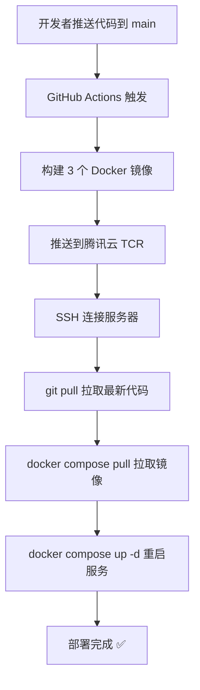

# 📝 部署配置最终方案

## 🎯 最终架构

### 双分支架构（已实施）

```
GitHub 仓库
    ├── main 分支（开发）
    │   └── 频繁推送，不自动部署，用户本地使用
    └── demo-without-gpu 分支（演示环境）
        └── 不常更新，推送时自动部署到服务器

服务器
    └── demo-without-gpu 分支
        └── 使用 docker-compose.demo.yml
            └── 拉取腾讯云预构建镜像
```

### 核心特点

- ✅ **双分支策略**：main 日常开发（不部署），demo 演示环境（自动部署）
- ✅ **预构建镜像**：在 GitHub Actions 中构建，推送到腾讯云
- ✅ **无需编译**：服务器端只需拉取镜像（适合小内存服务器）
- ✅ **轻量配置**：使用 docker-compose.demo.yml（无 GPU 依赖）
- ✅ **避免频繁部署**：main 推送不触发部署，只有 demo 分支推送才部署

## 📊 部署流程



## 🔧 关键配置文件

### 1. GitHub Actions 工作流
**文件**: `.github/workflows/deploy.yml`

**关键配置**:
```yaml
on:
  push:
    branches:
      - main  # 只监听 main 分支

jobs:
  build-and-push:
    # 构建并推送到腾讯云
    - 构建 app 镜像
    - 构建 worker 镜像
    - 构建 markitdown 镜像
    
  deploy:
    # 部署到服务器
    - SSH 到服务器
    - git pull origin main
    - docker compose -f docker-compose.demo.yml pull
    - docker compose -f docker-compose.demo.yml up -d
```

### 2. Docker Compose 配置
**文件**: `docker-compose.demo.yml`

**关键配置**:
```yaml
services:
  app:
    image: jpccr.ccs.tencentyun.com/deepmedsearch/deepmed-search:latest
    # 注释掉 build 配置（不在服务器编译）
    
  queue-worker:
    image: jpccr.ccs.tencentyun.com/deepmedsearch/deepmed-search-worker:latest
    
  markitdown:
    image: jpccr.ccs.tencentyun.com/deepmedsearch/deepmed-markitdown:latest
```

### 3. 腾讯云镜像仓库
**地址**: `jpccr.ccs.tencentyun.com`  
**命名空间**: `deepmedsearch`

**镜像列表**:
- `deepmed-search:latest` (主应用)
- `deepmed-search-worker:latest` (队列工作进程)
- `deepmed-markitdown:latest` (文档解析服务)

## 🔐 GitHub Secrets 配置

必需的 Secrets：

| Secret 名称 | 说明 | 获取方式 |
|------------|------|---------|
| `TENCENT_REGISTRY_USER` | 腾讯云账号 ID | 腾讯云控制台 |
| `TENCENT_REGISTRY_PASSWORD` | TCR 访问密码 | TCR 控制台生成 |
| `SERVER_HOST` | 服务器 IP 地址 | 你的服务器 |
| `SERVER_USER` | SSH 用户名 | 通常是 `deploy` |
| `SSH_PRIVATE_KEY` | SSH 私钥内容 | `cat ~/.ssh/id_rsa` |

## 🚀 使用方法

### 首次部署

**1. 服务器准备**
```bash
# 1. 安装 Docker
curl -fsSL https://get.docker.com | bash

# 2. 创建部署用户
sudo useradd -m -s /bin/bash deploy
sudo usermod -aG docker deploy

# 3. 切换到部署用户
sudo su - deploy

# 4. 登录腾讯云 TCR
docker login jpccr.ccs.tencentyun.com -u <账号ID> -p <密码>

# 5. 克隆项目
cd /home/deploy
git clone https://github.com/your-org/deepmed-search.git
cd deepmed-search

# 6. 配置环境变量
cp .env.example .env
nano .env  # 编辑配置

# 7. 首次部署
docker compose -f docker-compose.demo.yml pull
docker compose -f docker-compose.demo.yml up -d
```

**2. 配置 GitHub Secrets**

在 GitHub 仓库添加上述 5 个 Secrets。

**3. 触发部署**

```bash
# 推送代码到 main 分支即可自动部署
git add .
git commit -m "feat: 新功能"
git push origin main
```

### 日常开发（main 分支）

```bash
# 在 main 分支开发
git add .
git commit -m "feat: 添加功能"
git push origin main

# main 分支不触发自动部署
# 开发者本地运行：docker compose up -d
```

### 更新演示环境（触发部署）

```bash
# 合并 main 到 demo 分支
git checkout demo-without-gpu
git merge main
git push origin demo-without-gpu

# GitHub Actions 自动：
# 1. 构建镜像
# 2. 推送到腾讯云
# 3. 部署到演示服务器

# 查看部署状态
# https://github.com/your-org/deepmed-search/actions
```

### 手动操作（如需要）

```bash
# SSH 到服务器
ssh deploy@your-server

# 查看服务状态
cd /home/deploy/deepmed-search
docker compose -f docker-compose.demo.yml ps

# 查看日志
docker compose -f docker-compose.demo.yml logs -f app

# 重启服务
docker compose -f docker-compose.demo.yml restart app

# 手动更新部署
git pull origin main
docker compose -f docker-compose.demo.yml pull
docker compose -f docker-compose.demo.yml up -d
```

## 📈 资源占用

**服务器要求**（轻量配置）:
- CPU: 2 核+
- 内存: 2GB+（无需编译，内存占用小）
- 磁盘: 20GB+
- 网络: 国内服务器（快速访问腾讯云）

**镜像大小**（预估）:
- app 镜像: ~500MB
- worker 镜像: ~500MB
- markitdown 镜像: ~300MB
- 其他服务: ~2GB（PostgreSQL, Redis, Milvus 等）

**总计**: 约 4GB 磁盘空间

## ✅ 验证清单

部署前检查：

- [ ] GitHub Secrets 已配置（5 个）
- [ ] 腾讯云 TCR 命名空间已创建（deepmedsearch）
- [ ] 服务器已安装 Docker
- [ ] 服务器已登录腾讯云 TCR
- [ ] 服务器已克隆项目
- [ ] .env 文件已配置
- [ ] SSH 密钥已配置（可以从本地 SSH 到服务器）

部署后验证：

- [ ] GitHub Actions 运行成功
- [ ] 镜像已推送到腾讯云
- [ ] 服务器容器正常运行（docker compose ps）
- [ ] 应用可以访问（http://your-domain 或 http://server-ip:3000）
- [ ] Traefik 配置正确（如果使用）
- [ ] SSL 证书自动获取（如果使用 Traefik）

## 🔧 故障排查

### 1. GitHub Actions 失败

**检查**:
- GitHub Secrets 是否正确
- 腾讯云凭证是否有效
- SSH 连接是否正常

**解决**:
```bash
# 本地测试 SSH 连接
ssh -i ~/.ssh/your_key deploy@your-server

# 本地测试腾讯云登录
docker login jpccr.ccs.tencentyun.com -u <ID> -p <密码>
```

### 2. 服务器拉取镜像失败

**检查**:
```bash
# 检查是否登录
docker login jpccr.ccs.tencentyun.com

# 手动拉取测试
docker pull jpccr.ccs.tencentyun.com/deepmedsearch/deepmed-search:latest
```

### 3. 服务启动失败

**检查**:
```bash
# 查看详细日志
docker compose -f docker-compose.demo.yml logs

# 检查配置
docker compose -f docker-compose.demo.yml config

# 检查端口占用
sudo lsof -i :3000
sudo lsof -i :80
sudo lsof -i :443
```

## 📚 相关文档

- [快速开始指南](DEPLOYMENT_QUICKSTART.md)
- [腾讯云配置详解](docs/deployment/TENCENT_CLOUD_REGISTRY.md)
- [CI/CD 完整指南](docs/deployment/CICD_SETUP.md)
- [Docker Compose 使用](docs/deployment/DOCKER_COMPOSE_USAGE.zh-CN.md)

## 🎉 总结

**最终方案特点**:
1. ✅ 架构简单：单分支策略
2. ✅ 部署快速：无需服务器编译
3. ✅ 成本低廉：小内存服务器即可
4. ✅ 国内友好：使用腾讯云
5. ✅ 全自动化：推送即部署

---

**配置完成日期**: 2025-11-15  
**维护状态**: ✅ 已上线运行

