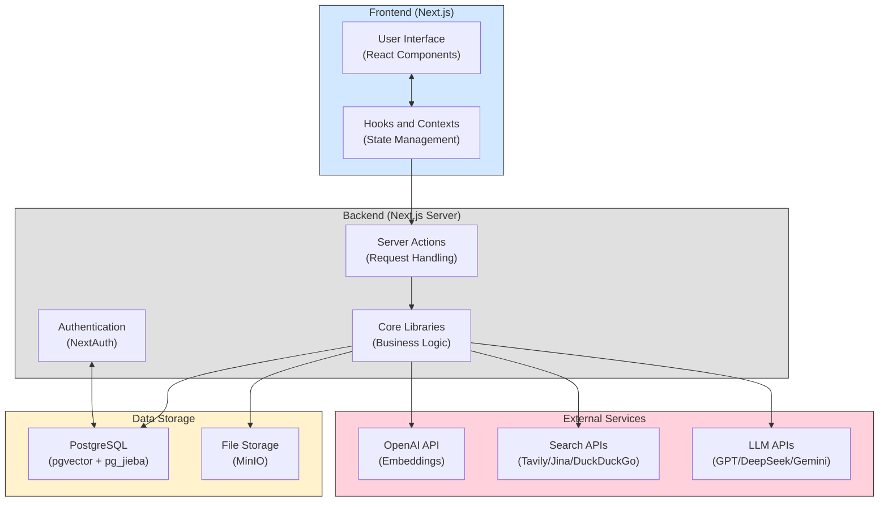

# DeepMed Search

[English](#english) | [中文](#中文)

<a name="english"></a>
# DeepMed Search

> **Note:** This project is still a work in progress. Some features may be incomplete or subject to change.

DeepMed Search is a versatile search application built with the Next.js App Router, featuring a unified interface for Web Search, LLM Introspection, and Knowledge Base (KB) Search.

## Features

-   **Unified Search Interface**: Single search bar with tabs to switch between Web, LLM, and Knowledge Base search types.
-   **Web Search**:
    -   Choose search engine (Tavily, Jina, DuckDuckGo) via dropdown.
    -   Displays standard list of web search results.
-   **LLM Introspection**:
    -   Select LLM model (Gemini, GPT, DeepSeek) via dropdown.
    -   Generates and displays simulated search results based on the LLM's internal knowledge.
-   **Knowledge Base Search**:
    -   Select specific Knowledge Base to search within via dropdown.
    -   Retrieves and displays relevant text chunks based on semantic similarity.
    -   Supports hybrid search combining vector similarity and traditional BM25 text search.
    -   Native Chinese text search support using pg_jieba segmentation.
    -   Results show source document, relevance score, and page number (if available).
    -   Clickable results open a modal dialog showing the full chunk text and details.
-   **Knowledge Base Management**: Context and actions available for listing, creating, updating, and deleting knowledge bases (implies corresponding UI features).
-   **Responsive Design**: Built with shadcn/ui and Tailwind CSS for adaptability across devices.
-   **Multi-language Support**: Integrated translation capabilities using `react-i18next`.
-   **Server Actions**: Utilizes Next.js Server Actions for secure and efficient backend operations.

## Technology Stack

-   **Framework**: Next.js 14+ (App Router)
-   **Language**: TypeScript
-   **UI**: React 19 (or latest), Tailwind CSS, shadcn/ui, Radix UI, Lucide Icons
-   **Database**: PostgreSQL (for structured data and likely vector storage via pgvector)
-   **ORM**: Prisma
-   **Vector Embeddings**: OpenAI API (or compatible) for generating text embeddings.
-   **State Management**: React Context API (`KnowledgeBaseContext`), React Query (potentially, if used elsewhere)
-   **Backend Logic**: Next.js Server Actions
-   **APIs/SDKs**:
    -   AI SDK (potentially for LLM interactions)
    -   OpenAI API (Embeddings)
    -   Tavily API
    -   Jina Search API
    -   DeepSeek API (potentially)
    -   Gemini API (potentially)
-   **Internationalization**: react-i18next, i18next
-   **Styling**: Tailwind CSS
-   **Forms**: React Hook Form (likely used in management UI), Zod (for validation)
-   **File Handling**: react-dropzone (likely used in KB uploads)
-   **Development Tools**: ESLint, Prettier, Husky

## System Architecture



## Quick Start

### Start Dependencies with Docker Compose

本项目使用Docker Compose管理开发环境的依赖服务，特别是包含了配置好的PostgreSQL（已安装pgvector和pg_jieba扩展）。

```bash
# 启动所需服务
docker-compose up -d postgres

# 查看服务状态
docker-compose ps
```

PostgreSQL服务会自动初始化并支持向量搜索和中文分词。初始化脚本位于`pgvector-zh/init.sql`。

### Service Access Points

*(Adjust based on your `docker-compose.yml`)*

-   **PostgreSQL**: `localhost:5432` (User: `postgres`, Pass: `postgres`, DB: `deepmed`)
-   **MinIO**: API: `localhost:9000`, Console: `localhost:9001` (User: `minioadmin`, Pass: `minioadmin`)
-   **Redis**: `localhost:6379` (if used)
  
### Development Environment Setup

1.  Install dependencies:
    ```bash
    npm install
    # or yarn install
    ```

2.  Set up environment variables:
    ```bash
    cp .env.example .env.local
    ```
    Edit `.env.local` and configure at least the following:
    -   `DATABASE_URL`: Your PostgreSQL connection string.
    -   `NEXTAUTH_URL`, `NEXTAUTH_SECRET`: For NextAuth.js authentication.
    -   `OPENAI_API_KEY`, `OPENAI_BASE_URL`: For generating embeddings (required for KB search).
    -   `TAVILY_API_KEY`: For Tavily web search.
    -   `JINA_API_KEY`: For Jina web search.
    -   (Optional) Keys/endpoints for other LLMs (Gemini, DeepSeek) or AI proxies if used directly.
    -   (Optional) MinIO credentials if using file storage.
    -   (Optional) OAuth provider credentials if enabled.

3.  Initialize Database & Run Migrations:
    ```bash
    npx prisma migrate dev
    # or yarn db:migrate
    ```
    *(Ensure the pgvector extension is enabled in your PostgreSQL database if using it for KB search)*

4.  Start development server:
    ```bash
    npm run dev
    # or yarn dev
    ```

5.  Access the application at `http://localhost:3000`.

## Development Guide

### Database Migration

Use Prisma for database migrations:

```bash
# Generate migration after schema changes
npx prisma migrate dev --name <migration-name>

# Apply migrations (usually handled by `migrate dev` or in deployment)
# npx prisma migrate deploy
```

### Knowledge Base Vector Search Setup

-   KB search relies on vector embeddings. Ensure the embedding model provider (e.g., OpenAI) is configured via environment variables (`OPENAI_API_KEY`, `OPENAI_BASE_URL`).
-   The application appears to use PostgreSQL with the `pgvector` extension for storing and searching vectors (`@/lib/pgvector/operations`). Make sure the `pgvector` extension is installed and enabled in your PostgreSQL database.
-   Document processing and embedding generation likely happen during file upload to a knowledge base (logic not fully shown here).

*(Remove the old Milvus connection example)*

## Available Scripts

*(Review your `package.json` for accuracy)*

```bash
yarn dev         # Start development server
yarn lint        # Run code linting

yarn db:generate # Generate Prisma Client
yarn db:migrate  # Run database migrations (dev)
yarn db:studio   # Start Prisma Studio

yarn test        # Run tests (if configured)

yarn build       # Build for production
yarn start       # Start production server

yarn create:user # Create test user account (if script exists)
```

## UI Components

This project uses [shadcn/ui](https://ui.shadcn.com/) for its component library. Add new components using:

```bash
npx shadcn@latest add <component-name>
```
Components are added to `src/components/ui`.

## 故障排除

### 知识库搜索问题

如果知识库搜索返回空结果或结果不符合预期，可以尝试以下解决方案：

1. **检查数据库扩展**：
   确保 PostgreSQL 数据库已正确安装并启用 `pgvector` 和 `pg_jieba` 扩展：
   ```bash
   yarn db:test
   ```
   如果测试失败，请尝试重新初始化：
   ```bash
   yarn db:init
   ```

2. **调整搜索参数**：
   您可以在 `src/lib/pgvector/operations.ts` 中修改 `searchSimilarChunks` 函数的默认参数：
   - 降低 `minSimilarity` 阈值可以获得更多结果
   - 调整 `bm25Weight` 和 `vectorWeight` 的比值可以平衡关键词匹配和语义理解
   - 对于中文搜索，建议同时使用向量搜索和全文搜索（混合模式）

3. **索引问题**：
   如果修改了搜索逻辑或重置了数据库，可能需要重新创建索引：
   ```bash
   psql $DATABASE_URL -f scripts/chunk.sql
   ```

4. **检查嵌入模型**：
   确保您的 OpenAI API 密钥和基本 URL 配置正确，这对生成文档嵌入至关重要。

5. **中文搜索提示**：
   - 对于中文搜索，使用较短、较为明确的搜索关键词通常效果更好
   - 如果搜索结果为空，系统会诚实告知用户并建议尝试其他相关问题

---

<a name="中文"></a>
# DeepMed Search

> **注意：** 本项目仍在开发中。部分功能可能不完整或将来会有变更。

DeepMed Search 是一个基于 Next.js App Router 构建的多功能搜索应用程序，提供统一的网页搜索、LLM 内省和知识库（KB）搜索界面。

## 功能特性

-   **统一搜索界面**: 单一搜索框，通过选项卡切换网页、LLM 和知识库搜索模式。
-   **网页搜索**:
    -   通过下拉菜单选择搜索引擎（Tavily、Jina、DuckDuckGo）。
    -   显示标准的网页搜索结果列表。
-   **LLM 内省**:
    -   通过下拉菜单选择 LLM 模型（Gemini、GPT、DeepSeek）。
    -   基于 LLM 的内部知识生成并显示模拟的搜索结果。
-   **知识库搜索**:
    -   通过下拉菜单选择要搜索的特定知识库。
    -   基于语义相似度检索并显示相关的文本块。
    -   支持混合搜索，结合向量相似度和传统 BM25 文本搜索。
    -   使用 pg_jieba 分词支持中文文本搜索。
    -   结果显示来源文档、相关性分数和页码（如果可用）。
    -   点击结果项会弹出模态对话框，显示完整的文本块内容和详细信息。
-   **知识库管理**: 提供了用于列出、创建、更新和删除知识库的 Context 和 Server Actions（意味着存在相应的管理界面）。
-   **响应式设计**: 使用 shadcn/ui 和 Tailwind CSS 构建，适应不同设备。
-   **多语言支持**: 集成了 `react-i18next` 实现翻译功能。
-   **Server Actions**: 利用 Next.js Server Actions 实现安全高效的后端操作。

## 技术栈

-   **框架**: Next.js 14+ (App Router)
-   **语言**: TypeScript
-   **UI**: React 19 (或最新版), Tailwind CSS, shadcn/ui, Radix UI, Lucide Icons
-   **数据库**: PostgreSQL (用于结构化数据，且很通过 pgvector 存储向量)
-   **ORM**: Prisma
-   **向量嵌入**: OpenAI API (或兼容接口) 用于生成文本嵌入。
-   **状态管理**: React Context API (`KnowledgeBaseContext`), React Query (如果在其他地方使用)
-   **后端逻辑**: Next.js Server Actions
-   **API/SDK**:
    -   AI SDK (可能用于 LLM 交互)
    -   OpenAI API (Embeddings)
    -   Tavily API
    -   Jina Search API
    -   DeepSeek API (可能)
    -   Gemini API (可能)
-   **国际化**: react-i18next, i18next
-   **样式**: Tailwind CSS
-   **表单**: React Hook Form (可能用于管理界面), Zod (用于验证)
-   **文件处理**: react-dropzone (可能用于知识库上传)
-   **开发工具**: ESLint, Prettier, Husky

## 系统架构


## 快速开始

### 使用 Docker Compose 启动依赖服务

本项目使用Docker Compose管理开发环境的依赖服务，特别是包含了配置好的PostgreSQL（已安装pgvector和pg_jieba扩展）。

```bash
# 启动所需服务
docker-compose up -d postgres

# 查看服务状态
docker-compose ps
```

PostgreSQL服务会自动初始化并支持向量搜索和中文分词。初始化脚本位于`pgvector-zh/init.sql`。

### 服务访问地址

-   **PostgreSQL**: `localhost:5432` (用户: `postgres`, 密码: `postgres`, 数据库: `deepmed`)
-   **MinIO**: API: `localhost:9000`, 控制台: `localhost:9001` (用户: `minioadmin`, 密码: `minioadmin`)（如果使用MinIO存储文件）
-   **Redis**: `localhost:6379` (如果使用)
 

### 开发环境设置

1.  安装依赖:
    ```bash
    npm install
    # 或 yarn install
    ```

2.  设置环境变量:
    ```bash
    cp .env.example .env.local
    ```
    编辑 `.env.local` 文件，并至少配置以下项：
    -   `DATABASE_URL`: 你的 PostgreSQL 连接字符串。
    -   `NEXTAUTH_URL`, `NEXTAUTH_SECRET`: 用于 NextAuth.js 认证。
    -   `OPENAI_API_KEY`, `OPENAI_BASE_URL`: 用于生成 embeddings (知识库搜索必需)。
    -   `TAVILY_API_KEY`: 用于 Tavily 网页搜索。
    -   `JINA_API_KEY`: 用于 Jina 网页搜索。
    -   (可选) 其他 LLM (Gemini, DeepSeek) 的密钥/端点，或 AI 代理的配置（如果直接使用）。
    -   (可选) MinIO 凭证（如果使用文件存储）。
    -   (可选) OAuth 提供商凭证（如果启用）。

3.  初始化数据库并运行迁移:
    ```bash
    npx prisma migrate dev
    # 或 yarn db:migrate
    ```
    *(如果使用 pgvector 进行知识库搜索，请确保 PostgreSQL 数据库已安装并启用了 pgvector 扩展)*

4.  启动开发服务器:
    ```bash
    npm run dev
    # 或 yarn dev
    ```

5.  访问应用 `http://localhost:3000`。

## 开发指南

### 数据库迁移

使用 Prisma 进行数据库迁移：

```bash
# Schema 变更后生成迁移
npx prisma migrate dev --name <migration-name>

# 应用迁移 (通常由 `migrate dev` 处理或在部署时执行)
# npx prisma migrate deploy
```

### 知识库向量搜索设置

-   知识库搜索依赖向量嵌入。请确保通过环境变量 (`OPENAI_API_KEY`, `OPENAI_BASE_URL`) 配置了嵌入模型的提供者（例如 OpenAI）。
-   应用程序使用 PostgreSQL 及其 `pgvector` 扩展来存储和搜索向量 (`@/lib/pgvector/operations`)。请确保你的 PostgreSQL 数据库已安装并启用了 `pgvector` 扩展。
-   本应用还使用 `pg_jieba` 扩展支持中文分词，为全文搜索提供更好的中文支持。
-   文档处理和嵌入生成发生在文件上传到知识库的过程中。

#### 向量搜索与混合搜索

应用支持三种搜索模式：
- **向量搜索**：基于文本语义相似度的搜索（通过embeddings）
- **全文搜索**：基于BM25算法的传统文本搜索
- **混合搜索**：结合向量搜索和全文搜索的结果，平衡语义理解和关键词匹配

搜索参数可在代码中调整，关键参数包括：
- `bm25Weight` 和 `vectorWeight`：控制两种搜索模式的权重比例
- `bm25Threshold` 和 `vectorThreshold`：控制各自搜索模式的最低阈值
- `minSimilarity`：结果的最终相似度阈值

#### PostgreSQL 扩展设置

对于开发环境，可以使用项目中的初始化脚本：

```bash
# 首先创建数据库结构
yarn db:push

# 初始化所需的PostgreSQL扩展
yarn db:init

# 验证扩展安装和配置是否正确
yarn db:test
```

对于生产环境，需要手动确保PostgreSQL已安装以下扩展：
- `pgvector`：用于向量存储和相似度搜索
- `pg_jieba`：用于中文分词支持

## 可用脚本

*(请检查你的 `package.json` 以确保准确性)*

```bash
yarn dev         # 启动开发服务器
yarn lint        # 运行代码检查

yarn db:generate # 生成 Prisma 客户端
yarn db:migrate  # 运行数据库迁移 (dev)
yarn db:studio   # 启动 Prisma Studio

yarn test        # 运行测试 (如果已配置)

yarn build       # 构建生产版本
yarn start       # 启动生产服务器

yarn create:user # 创建测试用户账号 (如果脚本存在)
```

## UI 组件

本项目使用 [shadcn/ui](https://ui.shadcn.com/) 作为其组件库。使用以下命令添加新组件：

```bash
npx shadcn@latest add <component-name>
```
组件会被添加到 `src/components/ui` 目录。

## 故障排除

### 知识库搜索问题

如果知识库搜索返回空结果或结果不符合预期，可以尝试以下解决方案：

1. **检查数据库扩展**：
   确保 PostgreSQL 数据库已正确安装并启用 `pgvector` 和 `pg_jieba` 扩展：
   ```bash
   yarn db:test
   ```
   如果测试失败，请尝试重新初始化：
   ```bash
   yarn db:init
   ```

2. **调整搜索参数**：
   您可以在 `src/lib/pgvector/operations.ts` 中修改 `searchSimilarChunks` 函数的默认参数：
   - 降低 `minSimilarity` 阈值可以获得更多结果
   - 调整 `bm25Weight` 和 `vectorWeight` 的比值可以平衡关键词匹配和语义理解
   - 对于中文搜索，建议同时使用向量搜索和全文搜索（混合模式）

3. **索引问题**：
   如果修改了搜索逻辑或重置了数据库，可能需要重新创建索引：
   ```bash
   psql $DATABASE_URL -f scripts/chunk.sql
   ```

4. **检查嵌入模型**：
   确保您的 OpenAI API 密钥和基本 URL 配置正确，这对生成文档嵌入至关重要。

5. **中文搜索提示**：
   - 对于中文搜索，使用较短、较为明确的搜索关键词通常效果更好
   - 如果搜索结果为空，系统会诚实告知用户并建议尝试其他相关问题

## 示例操作

### 创建知识库并上传文档

以下是一些常见操作的步骤示例：

1. **启动应用**:
   ```bash
   # 启动数据库服务
   docker-compose up -d postgres
   
   # 启动应用
   yarn dev
   ```

2. **创建知识库**:
   - 访问 `/knowledge` 页面
   - 点击"创建知识库"按钮
   - 填写名称、描述等必要信息
   - 确认创建

3. **上传文档**:
   - 进入新创建的知识库详情页
   - 导航到"文件"标签
   - 点击上传区域或拖放文件
   - 支持的文件格式包括：PDF、DOCX、TXT等
   - 文件上传后会自动处理，生成向量嵌入

4. **搜索知识库**:
   - 访问主搜索页面 `/search`
   - 选择"知识库"tab
   - 从下拉菜单选择要搜索的知识库
   - 在搜索框中输入查询内容并搜索
   - 系统会返回最相关的文档片段