# DeepMed Search

[English](#english) | [中文](#中文)

<a name="english"></a>
# DeepMed Search

DeepMed Search is a versatile search application built with the Next.js App Router, featuring a unified interface for Web Search, LLM Introspection, and Knowledge Base (KB) Search.

## Features

-   **Unified Search Interface**: Single search bar with tabs to switch between Web, LLM, and Knowledge Base search types.
-   **Web Search**:
    -   Choose search engine (Tavily, Jina, DuckDuckGo) via dropdown.
    -   Displays standard list of web search results.
-   **LLM Introspection**:
    -   Select LLM model (Gemini, GPT, DeepSeek) via dropdown.
    -   Generates and displays simulated search results based on the LLM's internal knowledge.
-   **Knowledge Base Search**:
    -   Select specific Knowledge Base to search within via dropdown.
    -   Retrieves and displays relevant text chunks based on semantic similarity.
    -   Results show source document, relevance score, and page number (if available).
    -   Clickable results open a modal dialog showing the full chunk text and details.
-   **Knowledge Base Management**: Context and actions available for listing, creating, updating, and deleting knowledge bases (implies corresponding UI features).
-   **Responsive Design**: Built with shadcn/ui and Tailwind CSS for adaptability across devices.
-   **Multi-language Support**: Integrated translation capabilities using `react-i18next`.
-   **Server Actions**: Utilizes Next.js Server Actions for secure and efficient backend operations.

## Technology Stack

-   **Framework**: Next.js 14+ (App Router)
-   **Language**: TypeScript
-   **UI**: React 19 (or latest), Tailwind CSS, shadcn/ui, Radix UI, Lucide Icons
-   **Database**: PostgreSQL (for structured data and likely vector storage via pgvector)
-   **ORM**: Prisma
-   **Vector Embeddings**: OpenAI API (or compatible) for generating text embeddings.
-   **State Management**: React Context API (`KnowledgeBaseContext`), React Query (potentially, if used elsewhere)
-   **Backend Logic**: Next.js Server Actions
-   **APIs/SDKs**:
    -   AI SDK (potentially for LLM interactions)
    -   OpenAI API (Embeddings)
    -   Tavily API
    -   Jina Search API
    -   DeepSeek API (potentially)
    -   Gemini API (potentially)
-   **Internationalization**: react-i18next, i18next
-   **Styling**: Tailwind CSS
-   **Forms**: React Hook Form (likely used in management UI), Zod (for validation)
-   **File Handling**: react-dropzone (likely used in KB uploads)
-   **Development Tools**: ESLint, Prettier, Husky

## System Architecture

```mermaid

graph LR
    subgraph Frontend["用户浏览器 Frontend"]
        direction TB

        subgraph AppPages["页面 src/app"]
            LoginUI["登录页 (/login)"]
            SignupUI["注册页面"]
            SearchPageUI["搜索入口页 (/search)"]
            WebResultsPageUI["网页结果页 (/search/web/[query])"]
            LlmResultsPageUI["LLM结果页 (/search/llm/[query])"]
            KbResultsPageUI["KB结果页 (/search/kb/[query])"]
            KbListPageUI["知识库列表页 (/knowledge)"]
            KbDetailLayoutUI["知识库详情布局 (/knowledge/[kbId])"]
            %% KbFilesUI, KbSettingsUI, KbChatUI 在详情布局内
        end

        subgraph ContextsHooks["Contexts and Hooks src/contexts, src/hooks"]
            %% Contexts
            UserContext["UserContext (contexts/user-context)"]
            KbContext["KnowledgeBaseContext (contexts/knowledgebase-context)"]
            %% Hooks
            UseSendQuestionHook["useSendQuestion (hooks/use-search)"]
            UseTranslateHook["useTranslate (hooks/use-language)"]
            UseKbManagementHook["useKbManagement (用于管理页面的交互)"]
            UseChatHook["useChat Hook (用于聊天交互)"]
        end

        subgraph ComponentsUI["UI and 自定义组件 src/components"]
            SharedUIComps["shadcn/ui 组件 (components/ui)"]
            SearchFormInternal["SearchInputForm (内嵌组件)"]
            KbChunkItemInternal["KbChunkItem (内嵌组件)"]
            KbChunkModal["文本块详情 Dialog"]
            FileUploadComponent["文件上传组件"]
            MarkdownComponent["MarkdownContent"]
            PaginationControlsInternal["PaginationControls (内嵌组件)"]
        end

        %% 前端内部交互
        %% Pages use Hooks & Contexts
        AppPages --> ContextsHooks
        AppPages --> ComponentsUI

        %% Hooks use Contexts / other Hooks
        UseKbManagementHook --> KbContext
        UseChatHook --> UserContext
        UseSendQuestionHook --> Actions["Server Actions (间接)"] 
        %% "Hook 本身不直接调, 而是返回调用函数"

        %% Context Usage Examples
        SearchPageUI --> KbContext
        SearchPageUI --> UseTranslateHook
        KbResultsPageUI --> KbContext
        KbResultsPageUI --> UseTranslateHook
        KbListPageUI --> KbContext
        KbListPageUI --> UseKbManagementHook
        KbDetailLayoutUI --> KbContext
        KbDetailLayoutUI --> UseKbManagementHook
        %% KbChatUI uses UseChatHook

        KbChunkItemInternal --> KbChunkModal
    end

    subgraph Backend["Next.js 服务器 Backend"]
        direction TB
        ServerActions["Server Actions (src/actions)"]
        NextAuth["NextAuth (认证/会话)"]
        LibLayer["核心逻辑/库 (src/lib)"]

        subgraph Actions["Actions (src/actions)"]
            AuthActions["auth.ts"]
            KbSearchAction["kb-search.ts"]
            WebSearchAction["web-search.ts"]
            LlmSearchAction["llm-search.ts"]
            KbMgmtActions["knowledgebase.ts"]
            FileActions["file.ts (假设)"]
            ChatActions["chat.ts (假设)"]
        end

        subgraph Lib["Libraries (src/lib)"]
            %% Core Logic / DB
            PrismaSchema["prisma/schema.prisma (定义模型)"]
            PrismaClientLib["数据库客户端 (由Prisma生成)"]
            PgVectorOpsLib["pgvector/operations.ts (封装向量搜索/插入)"]

            %% AI / External Services
            OpenAIEmbedLib["openai/embedding.ts (getEmbedding)"]
            LlmSearchLib["llm-search/search.ts (searchSimulator, config)"]
            WebSearchCommonLib["web-search/common.ts (类型, 引擎实现)"]
            TavilyClient["Tavily 客户端/封装 (假设)"]
            JinaClient["Jina 客户端/封装 (假设)"]
            %% LLM API 客户端/封装 (若直接调用)

            %% Utilities / Config
            ConfigLib["config/ (各种配置)"]
            UtilsLib["utils/ (通用工具函数, logger)"]
            TypesLib["types/ (共享类型定义)"]
            I18nLib["i18n/ (国际化资源)"]
        end

        %% 后端内部交互: Actions use Libs
        ServerActions --> LibLayer

        KbSearchAction --> OpenAIEmbedLib
        KbSearchAction --> PgVectorOpsLib
        LlmSearchAction --> LlmSearchLib 
        %% LlmSearchLib 可能调用 LLM API Client
        WebSearchAction --> WebSearchCommonLib 
        %% WebSearchCommonLib 调用 Tavily/Jina Client
        KbMgmtActions --> PrismaClientLib
        KbMgmtActions --> MinIOClient["MinIO 客户端/封装 (假设)"]
        FileActions --> MinIOClient
        FileActions --> OpenAIEmbedLib
        FileActions --> PgVectorOpsLib
        FileActions --> PrismaClientLib
        ChatActions --> KbSearchAction 
        %% 复用搜索逻辑
        ChatActions --> LlmSearchLib 
        %% 或直接的 LLM Client

        %% Lib interactions
        PgVectorOpsLib --> PrismaClientLib 
        %% (pgvector通常需要SQL执行)
        LlmSearchLib --> OpenAIEmbedLib 
        %% (如果LLM需要Embedding)

        %% NextAuth Interaction
        NextAuth --> PrismaClientLib
    end

    subgraph DatabaseStorage["数据库 & 存储"]
        direction TB
        PG_StructuredDb["(PostgreSQL) 结构化数据"]
        PG_VectorDb["(PostgreSQL) pgvector"]
        MinIO_Store["MinIO 文件存储"]
        Redis_Cache["Redis 缓存/会话"]
    end

    subgraph ExternalServices["外部服务 / API"]
        direction TB
        EmbeddingService["Embedding API"]
        WebServiceAPIs["Web 搜索 API"]
        LlmServiceAPIs["LLM API"]
        OAuthProviders["OAuth 提供商"]
    end

    %% 主要流程连线 (Page -> Action -> Lib -> External/DB)
    AppPages -->|"1. 调用 Action"| ServerActions
    ServerActions -->|"2. 调用 Lib"| LibLayer
    LibLayer -->|"3. 调用外部API"| ExternalServices
    LibLayer -->|"4. 读写数据库"| DatabaseStorage
    LibLayer -->|"5. 返回给 Action"| ServerActions
    ServerActions -->|"6. 返回给 Page"| AppPages

    %% 认证
    AppPages -->|"触发认证"| NextAuth
    NextAuth --> OAuthProviders
    NextAuth --> PG_StructuredDb

    %% 样式
    style Frontend fill:#D1E8FF,stroke:#333
    style Backend fill:#E0E0E0,stroke:#333
    style DatabaseStorage fill:#FFF2CC,stroke:#333
    style ExternalServices fill:#FFD1DC,stroke:#333
```



## Quick Start

### Start Dependencies with Docker Compose

*(Review your `docker-compose.yml` to confirm services)*

```bash
# Start required services (e.g., PostgreSQL, Redis, MinIO)
docker-compose up -d

# Check service status
docker-compose ps
```

### Service Access Points

*(Adjust based on your `docker-compose.yml`)*

-   **PostgreSQL**: `localhost:5432` (User: `postgres`, Pass: `postgres`, DB: `deepmed`)
-   **MinIO**: API: `localhost:9000`, Console: `localhost:9001` (User: `minioadmin`, Pass: `minioadmin`)
-   **Redis**: `localhost:6379` (if used)

*(Remove Milvus/Attu if not used)*

### Development Environment Setup

1.  Install dependencies:
    ```bash
    npm install
    # or yarn install
    ```

2.  Set up environment variables:
    ```bash
    cp .env.example .env.local
    ```
    Edit `.env.local` and configure at least the following:
    -   `DATABASE_URL`: Your PostgreSQL connection string.
    -   `NEXTAUTH_URL`, `NEXTAUTH_SECRET`: For NextAuth.js authentication.
    -   `OPENAI_API_KEY`, `OPENAI_BASE_URL`: For generating embeddings (required for KB search).
    -   `TAVILY_API_KEY`: For Tavily web search.
    -   `JINA_API_KEY`: For Jina web search.
    -   (Optional) Keys/endpoints for other LLMs (Gemini, DeepSeek) or AI proxies if used directly.
    -   (Optional) MinIO credentials if using file storage.
    -   (Optional) OAuth provider credentials if enabled.

3.  Initialize Database & Run Migrations:
    ```bash
    npx prisma migrate dev
    # or yarn db:migrate
    ```
    *(Ensure the pgvector extension is enabled in your PostgreSQL database if using it for KB search)*

4.  Start development server:
    ```bash
    npm run dev
    # or yarn dev
    ```

5.  Access the application at `http://localhost:3000`.

## Development Guide

### Database Migration

Use Prisma for database migrations:

```bash
# Generate migration after schema changes
npx prisma migrate dev --name <migration-name>

# Apply migrations (usually handled by `migrate dev` or in deployment)
# npx prisma migrate deploy
```

### Knowledge Base Vector Search Setup

-   KB search relies on vector embeddings. Ensure the embedding model provider (e.g., OpenAI) is configured via environment variables (`OPENAI_API_KEY`, `OPENAI_BASE_URL`).
-   The application appears to use PostgreSQL with the `pgvector` extension for storing and searching vectors (`@/lib/pgvector/operations`). Make sure the `pgvector` extension is installed and enabled in your PostgreSQL database.
-   Document processing and embedding generation likely happen during file upload to a knowledge base (logic not fully shown here).

*(Remove the old Milvus connection example)*

## Available Scripts

*(Review your `package.json` for accuracy)*

```bash
yarn dev         # Start development server
yarn lint        # Run code linting

yarn db:generate # Generate Prisma Client
yarn db:migrate  # Run database migrations (dev)
yarn db:studio   # Start Prisma Studio

yarn test        # Run tests (if configured)

yarn build       # Build for production
yarn start       # Start production server

yarn create:user # Create test user account (if script exists)
```

## UI Components

This project uses [shadcn/ui](https://ui.shadcn.com/) for its component library. Add new components using:

```bash
npx shadcn@latest add <component-name>
```
Components are added to `src/components/ui`.

---

<a name="中文"></a>
# DeepMed Search

DeepMed Search 是一个基于 Next.js App Router 构建的多功能搜索应用程序，提供统一的网页搜索、LLM 内省和知识库（KB）搜索界面。

## 功能特性

-   **统一搜索界面**: 单一搜索框，通过选项卡切换网页、LLM 和知识库搜索模式。
-   **网页搜索**:
    -   通过下拉菜单选择搜索引擎（Tavily、Jina、DuckDuckGo）。
    -   显示标准的网页搜索结果列表。
-   **LLM 内省**:
    -   通过下拉菜单选择 LLM 模型（Gemini、GPT、DeepSeek）。
    -   基于 LLM 的内部知识生成并显示模拟的搜索结果。
-   **知识库搜索**:
    -   通过下拉菜单选择要搜索的特定知识库。
    -   基于语义相似度检索并显示相关的文本块。
    -   结果显示来源文档、相关性分数和页码（如果可用）。
    -   点击结果项会弹出模态对话框，显示完整的文本块内容和详细信息。
-   **知识库管理**: 提供了用于列出、创建、更新和删除知识库的 Context 和 Server Actions（意味着存在相应的管理界面）。
-   **响应式设计**: 使用 shadcn/ui 和 Tailwind CSS 构建，适应不同设备。
-   **多语言支持**: 集成了 `react-i18next` 实现翻译功能。
-   **Server Actions**: 利用 Next.js Server Actions 实现安全高效的后端操作。

## 技术栈

-   **框架**: Next.js 14+ (App Router)
-   **语言**: TypeScript
-   **UI**: React 19 (或最新版), Tailwind CSS, shadcn/ui, Radix UI, Lucide Icons
-   **数据库**: PostgreSQL (用于结构化数据，且很可能通过 pgvector 存储向量)
-   **ORM**: Prisma
-   **向量嵌入**: OpenAI API (或兼容接口) 用于生成文本嵌入。
-   **状态管理**: React Context API (`KnowledgeBaseContext`), React Query (如果在其他地方使用)
-   **后端逻辑**: Next.js Server Actions
-   **API/SDK**:
    -   AI SDK (可能用于 LLM 交互)
    -   OpenAI API (Embeddings)
    -   Tavily API
    -   Jina Search API
    -   DeepSeek API (可能)
    -   Gemini API (可能)
-   **国际化**: react-i18next, i18next
-   **样式**: Tailwind CSS
-   **表单**: React Hook Form (可能用于管理界面), Zod (用于验证)
-   **文件处理**: react-dropzone (可能用于知识库上传)
-   **开发工具**: ESLint, Prettier, Husky

## 系统架构

```mermaid
graph LR
    subgraph Frontend[用户浏览器 Frontend]
        direction TB

        subgraph AppPages [页面 (`src/app`)]
            LoginUI("登录页 (`/login`)")
            SignupUI("注册页面")
            SearchPageUI("搜索入口页 (`/search`)")
            WebResultsPageUI("网页结果页 (`/search/web/[query]`)")
            LlmResultsPageUI("LLM结果页 (`/search/llm/[query]`)")
            KbResultsPageUI("KB结果页 (`/search/kb/[query]`)")
            KbListPageUI("知识库列表页 (`/knowledge`)")
            KbDetailLayoutUI("知识库详情布局 (`/knowledge/[kbId]`)")
            %% KbFilesUI, KbSettingsUI, KbChatUI 在详情布局内
        end

        subgraph ContextsHooks [Contexts & Hooks (`src/contexts`, `src/hooks`)]
             %% Contexts
             UserContext("UserContext (`contexts/user-context`)")
             KbContext("KnowledgeBaseContext (`contexts/knowledgebase-context`)")
             %% Hooks
             UseSendQuestionHook("useSendQuestion (`hooks/use-search`)")
             UseTranslateHook("useTranslate (`hooks/use-language`)")
             UseKbManagementHook("useKbManagement (假设, 用于管理页面的交互)")
             UseChatHook("useChat Hook (假设, 用于聊天交互)")
        end

        subgraph ComponentsUI [UI & 自定义组件 (`src/components`)]
             SharedUIComps("shadcn/ui 组件 (`components/ui`)")
             SearchFormInternal("SearchInputForm (内嵌组件)")
             KbChunkItemInternal("KbChunkItem (内嵌组件)")
             KbChunkModal("文本块详情 Dialog")
             FileUploadComponent("文件上传组件")
             MarkdownComponent("MarkdownContent")
             PaginationControlsInternal("PaginationControls (内嵌组件)")
        end

        %% 前端内部交互
        %% Pages use Hooks & Contexts
        AppPages -- 使用 --> ContextsHooks
        AppPages -- 使用 --> ComponentsUI

        %% Hooks use Contexts / other Hooks
        UseKbManagementHook -- 使用 --> KbContext
        UseChatHook -- 可能使用 --> UserContext
        UseSendQuestionHook -- 可能调用 --> Actions["Server Actions (间接)"] %% Hook 本身不直接调, 而是返回调用函数

        %% Context Usage Examples
        SearchPageUI -- 使用 --> KbContext
        SearchPageUI -- 使用 --> UseTranslateHook
        KbResultsPageUI -- 使用 --> KbContext
        KbResultsPageUI -- 使用 --> UseTranslateHook
        KbListPageUI -- 使用 --> KbContext
        KbListPageUI -- 使用 --> UseKbManagementHook
        KbDetailLayoutUI -- 使用 --> KbContext
        KbDetailLayoutUI -- 使用 --> UseKbManagementHook
        %% KbChatUI uses UseChatHook

        KbChunkItemInternal -- 触发 --> KbChunkModal

    end

    subgraph Backend[Next.js 服务器 Backend]
        direction TB
        ServerActions("Server Actions (`src/actions`)")
        NextAuth("NextAuth (认证/会话)")
        LibLayer("核心逻辑/库 (`src/lib`)")

        subgraph Actions [Actions (`src/actions`)]
             AuthActions("auth.ts")
             KbSearchAction("kb-search.ts")
             WebSearchAction("web-search.ts")
             LlmSearchAction("llm-search.ts")
             KbMgmtActions("knowledgebase.ts")
             FileActions("file.ts (假设)")
             ChatActions("chat.ts (假设)")
        end

        subgraph Lib [Libraries (`src/lib`)]
             %% Core Logic / DB
             PrismaSchema("prisma/schema.prisma (定义模型)")
             PrismaClientLib("数据库客户端 (由Prisma生成)")
             PgVectorOpsLib("pgvector/operations.ts (封装向量搜索/插入)")

             %% AI / External Services
             OpenAIEmbedLib("openai/embedding.ts (getEmbedding)")
             LlmSearchLib("llm-search/search.ts (searchSimulator, config)")
             WebSearchCommonLib("web-search/common.ts (类型, 引擎实现)")
             TavilyClient("Tavily 客户端/封装 (假设)")
             JinaClient("Jina 客户端/封装 (假设)")
             %% LLM API 客户端/封装 (若直接调用)

             %% Utilities / Config
             ConfigLib("config/ (各种配置)")
             UtilsLib("utils/ (通用工具函数, logger)")
             TypesLib("types/ (共享类型定义)")
             I18nLib("i18n/ (国际化资源)")
        end

        %% 后端内部交互: Actions use Libs
        ServerActions -- 调用 --> LibLayer

        KbSearchAction -- 调用 --> OpenAIEmbedLib
        KbSearchAction -- 调用 --> PgVectorOpsLib
        LlmSearchAction -- 调用 --> LlmSearchLib %% LlmSearchLib 可能调用 LLM API Client
        WebSearchAction -- 调用 --> WebSearchCommonLib %% WebSearchCommonLib 调用 Tavily/Jina Client
        KbMgmtActions -- 调用 --> PrismaClientLib
        KbMgmtActions -- 可能调用 --> MinIOClient["MinIO 客户端/封装 (假设)"]
        FileActions -- 调用 --> MinIOClient
        FileActions -- 调用 --> OpenAIEmbedLib
        FileActions -- 调用 --> PgVectorOpsLib
        FileActions -- 调用 --> PrismaClientLib
        ChatActions -- 可能调用 --> KbSearchAction %% 复用搜索逻辑
        ChatActions -- 可能调用 --> LlmSearchLib %% 或直接的 LLM Client

        %% Lib interactions
        PgVectorOpsLib -- 使用 --> PrismaClientLib %% (pgvector通常需要SQL执行)
        LlmSearchLib -- 可能调用 --> OpenAIEmbedLib %% (如果LLM需要Embedding)

        %% NextAuth Interaction
        NextAuth -- 交互 --> PrismaClientLib
    end

    subgraph DatabaseStorage[数据库 & 存储]
        direction TB
        PG_StructuredDb("(PostgreSQL) 结构化数据")
        PG_VectorDb("(PostgreSQL) pgvector")
        MinIO_Store("MinIO 文件存储")
        Redis_Cache("Redis 缓存/会话")
    end

    subgraph ExternalServices[外部服务 / API]
        direction TB
        EmbeddingService("Embedding API")
        WebServiceAPIs("Web 搜索 API")
        LlmServiceAPIs("LLM API")
        OAuthProviders("OAuth 提供商")
    end

    %% 主要流程连线 (Page -> Action -> Lib -> External/DB)
    AppPages -- "1. 调用 Action" --> ServerActions
    ServerActions -- "2. 调用 Lib" --> LibLayer
    LibLayer -- "3. 调用外部API" --> ExternalServices
    LibLayer -- "4. 读写数据库" --> DatabaseStorage
    LibLayer -- "5. 返回给 Action" --> ServerActions
    ServerActions -- "6. 返回给 Page" --> AppPages

    %% 认证
    AppPages -- "触发认证" --> NextAuth
    NextAuth -- 交互 --> OAuthProviders
    NextAuth -- 读写用户 --> PG_StructuredDb

    %% 样式
    style Frontend fill:#D1E8FF,stroke:#333
    style Backend fill:#E0E0E0,stroke:#333
    style DatabaseStorage fill:#FFF2CC,stroke:#333
    style ExternalServices fill:#FFD1DC,stroke:#333
```

## 快速开始

### 使用 Docker Compose 启动依赖服务

*(请检查你的 `docker-compose.yml` 文件确认服务列表)*

```bash
# 启动所需服务 (例如 PostgreSQL, Redis, MinIO)
docker-compose up -d

# 查看服务状态
docker-compose ps
```

### 服务访问地址

*(根据你的 `docker-compose.yml` 调整)*

-   **PostgreSQL**: `localhost:5432` (用户: `postgres`, 密码: `postgres`, 数据库: `deepmed`)
-   **MinIO**: API: `localhost:9000`, 控制台: `localhost:9001` (用户: `minioadmin`, 密码: `minioadmin`)
-   **Redis**: `localhost:6379` (如果使用)

*(如果未使用 Milvus/Attu，请移除相关信息)*

### 开发环境设置

1.  安装依赖:
    ```bash
    npm install
    # 或 yarn install
    ```

2.  设置环境变量:
    ```bash
    cp .env.example .env.local
    ```
    编辑 `.env.local` 文件，并至少配置以下项：
    -   `DATABASE_URL`: 你的 PostgreSQL 连接字符串。
    -   `NEXTAUTH_URL`, `NEXTAUTH_SECRET`: 用于 NextAuth.js 认证。
    -   `OPENAI_API_KEY`, `OPENAI_BASE_URL`: 用于生成 embeddings (知识库搜索必需)。
    -   `TAVILY_API_KEY`: 用于 Tavily 网页搜索。
    -   `JINA_API_KEY`: 用于 Jina 网页搜索。
    -   (可选) 其他 LLM (Gemini, DeepSeek) 的密钥/端点，或 AI 代理的配置（如果直接使用）。
    -   (可选) MinIO 凭证（如果使用文件存储）。
    -   (可选) OAuth 提供商凭证（如果启用）。

3.  初始化数据库并运行迁移:
    ```bash
    npx prisma migrate dev
    # 或 yarn db:migrate
    ```
    *(如果使用 pgvector 进行知识库搜索，请确保 PostgreSQL 数据库已安装并启用了 pgvector 扩展)*

4.  启动开发服务器:
    ```bash
    npm run dev
    # 或 yarn dev
    ```

5.  访问应用 `http://localhost:3000`。

## 开发指南

### 数据库迁移

使用 Prisma 进行数据库迁移：

```bash
# Schema 变更后生成迁移
npx prisma migrate dev --name <migration-name>

# 应用迁移 (通常由 `migrate dev` 处理或在部署时执行)
# npx prisma migrate deploy
```

### 知识库向量搜索设置

-   知识库搜索依赖向量嵌入。请确保通过环境变量 (`OPENAI_API_KEY`, `OPENAI_BASE_URL`) 配置了嵌入模型的提供者（例如 OpenAI）。
-   应用程序似乎使用 PostgreSQL 及其 `pgvector` 扩展来存储和搜索向量 (`@/lib/pgvector/operations`)。请确保你的 PostgreSQL 数据库已安装并启用了 `pgvector` 扩展。
-   文档处理和嵌入生成可能发生在文件上传到知识库的过程中（具体逻辑此处未完全展示）。

*(移除旧的 Milvus 连接示例)*

## 可用脚本

*(请检查你的 `package.json` 以确保准确性)*

```bash
yarn dev         # 启动开发服务器
yarn lint        # 运行代码检查

yarn db:generate # 生成 Prisma 客户端
yarn db:migrate  # 运行数据库迁移 (dev)
yarn db:studio   # 启动 Prisma Studio

yarn test        # 运行测试 (如果已配置)

yarn build       # 构建生产版本
yarn start       # 启动生产服务器

yarn create:user # 创建测试用户账号 (如果脚本存在)
```

## UI 组件

本项目使用 [shadcn/ui](https://ui.shadcn.com/) 作为其组件库。使用以下命令添加新组件：

```bash
npx shadcn@latest add <component-name>
```
组件会被添加到 `src/components/ui` 目录。