# 🔄 CI/CD Automation Guide

Implement automated deployment using GitHub Actions - deploy automatically when pushing code.

> **Use Case**: Automated deployment, team collaboration, continuous integration

[中文](./CICD.zh-CN.md) | [Quick Deployment](./QUICKSTART.md) | [Production Environment](./PRODUCTION.md)

## 📋 Table of Contents

- [Architecture Overview](#architecture-overview)
- [Quick Setup](#quick-setup)
- [Tencent Cloud Container Registry](#tencent-cloud-container-registry)
- [GitHub Actions Configuration](#github-actions-configuration)
- [Branching Strategy](#branching-strategy)
- [Troubleshooting](#troubleshooting)

## 🏗️ Architecture Overview

### Deployment Flow

```mermaid
graph LR
    A[Push to demo-without-gpu] --> B[GitHub Actions Triggered]
    B --> C[Build Docker Images]
    C --> D[Push to Tencent Cloud TCR]
    D --> E[SSH to Server]
    E --> F[Pull Latest Code]
    F --> G[Pull Latest Images]
    G --> H[Restart Services]
    H --> I[Deployment Complete]
```



### Core Features

- ✅ **Automated Deployment**: Deploy automatically when pushing code
- ✅ **Pre-built Images**: GitHub Actions builds, server pulls directly
- ✅ **Resource Efficient**: No compilation on server, 2GB RAM is enough
- ✅ **Dual-Branch Strategy**: main for development (no auto-deploy), demo for auto-deploy
- ✅ **China-Friendly**: Uses Tencent Cloud TCR for fast access

## 🚀 Quick Setup

### 1. Configure GitHub Secrets

Visit GitHub repository settings:
```
Settings → Secrets and variables → Actions → New repository secret
```

Add the following Secrets:

| Name | Value | Description |
|------|-------|-------------|
| `TENCENT_REGISTRY_USER` | Tencent Cloud Account ID | 12-digit number |
| `TENCENT_REGISTRY_PASSWORD` | TCR Access Password | From Tencent Cloud console |
| `SERVER_HOST` | Server IP Address | e.g., `43.128.248.54` |
| `SERVER_USER` | SSH Username | e.g., `ubuntu` or `deploy` |
| `SSH_PRIVATE_KEY` | SSH Private Key | Complete private key (including BEGIN/END markers) |

### 2. Get Tencent Cloud TCR Credentials

**Steps:**

1. Visit [Tencent Cloud Container Registry Console](https://console.cloud.tencent.com/tcr)
2. Select Personal or Enterprise edition instance
3. Go to "Access Management" → "Access Credentials"
4. Generate access credentials:
   - **Username**: Your Tencent Cloud Account ID (12-digit number)
   - **Password**: Click "Generate Temporary Login Password" or use long-term password

**Personal Edition Address**: `jpccr.ccs.tencentyun.com`

**Image Naming Convention**:
- `jpccr.ccs.tencentyun.com/deepmedsearch/deepmed-search:latest` (main app)
- `jpccr.ccs.tencentyun.com/deepmedsearch/deepmed-search-worker:latest` (queue worker)
- `jpccr.ccs.tencentyun.com/deepmedsearch/deepmed-markitdown:latest` (document parser)

### 3. Configure Server SSH

**On the server:**

```bash
# 1. Create deployment user (if not exists)
sudo useradd -m -s /bin/bash deploy
sudo usermod -aG docker deploy

# 2. Switch to deployment user
sudo su - deploy

# 3. Generate SSH key pair
ssh-keygen -t ed25519 -C "github-actions-deploy" -f ~/.ssh/github_deploy

# 4. Add public key to authorized_keys
cat ~/.ssh/github_deploy.pub >> ~/.ssh/authorized_keys
chmod 600 ~/.ssh/authorized_keys

# 5. Display private key (copy to GitHub Secrets)
cat ~/.ssh/github_deploy

# 6. Login to Tencent Cloud TCR
docker login jpccr.ccs.tencentyun.com -u <AccountID> -p <TCR-Password>

# 7. Clone project
cd /home/deploy
git clone https://github.com/your-org/deepmed-search.git
cd deepmed-search
git checkout demo-without-gpu

# 8. Configure environment variables
cp .env.example .env
nano .env  # Edit configuration
```

### 4. Test Deployment

```bash
# Locally, push to demo branch to trigger deployment
git checkout demo-without-gpu
git push origin demo-without-gpu

# View GitHub Actions status
https://github.com/your-org/deepmed-search/actions
```

## 🌿 Branching Strategy

This project uses a **dual-branch deployment strategy**:

| Branch | Purpose | Deploy Trigger | Config File |
|--------|---------|---------------|-------------|
| `main` | Development | ❌ No trigger | `docker-compose.yml` |
| `demo-without-gpu` | Demo Environment | ✅ Auto-deploy | `docker-compose.demo.yml` |

### Daily Development Workflow

```bash
# 1. Develop on main branch
git checkout main
# ... develop features ...
git add .
git commit -m "feat: new feature"
git push origin main  # Does NOT trigger deployment

# 2. After feature complete, merge to demo branch
git checkout demo-without-gpu
git merge main
git push origin demo-without-gpu  # Triggers auto-deployment
```

See [Branching Strategy Documentation](./BRANCHING_STRATEGY.en.md) for details

## 📝 GitHub Actions Configuration

Project includes `.github/workflows/deploy.yml`, core configuration:

```yaml
name: Deploy to Server

on:
  push:
    branches:
      - demo-without-gpu  # Only demo branch triggers

jobs:
  build-and-push:
    runs-on: ubuntu-latest
    steps:
      - name: Build and Push Images
        # Build and push to Tencent Cloud TCR

  deploy:
    needs: build-and-push
    runs-on: ubuntu-latest
    steps:
      - name: Deploy to Server via SSH
        # SSH to server and deploy
```

### Deployment Script Actions

Automatically executes the following steps:

1. Pull latest configuration files (`git pull`)
2. Check `.env` file existence and key variables
3. Verify Docker Compose configuration
4. Check Tencent Cloud TCR login status
5. Pull latest images
6. Restart services
7. Check container health status
8. Send Feishu notification (if configured)

### Add Feishu Notification (Optional)

Add to GitHub Secrets:

```
FEISHU_WEBHOOK_URL=https://open.feishu.cn/open-apis/bot/v2/hook/your-webhook-id
```

Deployment success or failure will automatically send notification to Feishu group.

## 🔧 Server Configuration

### .env File Configuration

Must configure `.env` file on server:

```bash
# Database
POSTGRES_USER=postgres
POSTGRES_PASSWORD=<strong-password>
POSTGRES_DB=deepmed
DATABASE_URL=postgresql://postgres:<password>@postgres:5432/deepmed

# NextAuth
NEXTAUTH_URL=https://your-domain.com
NEXTAUTH_SECRET=<openssl rand -base64 32>

# Encryption
ENCRYPTION_KEY=<openssl rand -base64 32>

# MinIO
MINIO_ACCESS_KEY=minioadmin
MINIO_SECRET_KEY=<strong-password>
MINIO_PUBLIC_URL=https://your-domain.com
```

### Docker Compose Configuration

Project uses `docker-compose.demo.yml`, features:

- Uses Tencent Cloud pre-built images
- No GPU dependency (uses MarkItDown)
- Lightweight configuration, runs with 2GB RAM

## 🔍 Monitoring and Debugging

### View Deployment Status

**GitHub Actions:**
```
https://github.com/your-org/deepmed-search/actions
```

**Server Logs:**
```bash
# View all container status
docker compose -f docker-compose.demo.yml ps

# View application logs
docker compose -f docker-compose.demo.yml logs -f app

# View Worker logs
docker compose -f docker-compose.demo.yml logs -f queue-worker

# View recent deployment logs
tail -f ~/deepmed-search/deploy.log
```

### Manual Trigger Deployment

```bash
# Manually deploy on server
cd /home/deploy/deepmed-search
git pull origin demo-without-gpu
docker compose -f docker-compose.demo.yml pull
docker compose -f docker-compose.demo.yml up -d
```

## ❗ Troubleshooting

### Issue 1: SSH Connection Failed

```bash
# Check SSH service
sudo systemctl status sshd

# Check firewall
sudo ufw status
sudo ufw allow 22/tcp

# Test SSH connection
ssh -i ~/.ssh/github_deploy deploy@your-server-ip

# Check GitHub Actions SSH_PRIVATE_KEY
# Ensure it includes complete BEGIN/END markers
```

### Issue 2: Image Pull Failed

```bash
# Login to TCR on server
docker login jpccr.ccs.tencentyun.com -u <AccountID> -p <TCR-Password>

# Test pull image
docker pull jpccr.ccs.tencentyun.com/deepmedsearch/deepmed-search:latest

# Check network connection
ping jpccr.ccs.tencentyun.com
```

### Issue 3: Container Startup Failed

```bash
# Check .env file
cat .env | grep -E "POSTGRES|NEXTAUTH|ENCRYPTION"

# View detailed logs
docker compose -f docker-compose.demo.yml logs app

# Recreate containers
docker compose -f docker-compose.demo.yml up -d --force-recreate
```

### Issue 4: GitHub Actions Failed

1. Check if Secrets configuration is correct
2. View Actions logs to find specific error
3. Confirm server is accessible via SSH
4. Confirm server has enough disk space

## 📚 Related Documentation

- [Branching Strategy](./BRANCHING_STRATEGY.en.md) - Detailed branch usage strategy
- [Tencent Cloud TCR](./TENCENT_CLOUD_REGISTRY.md) - TCR detailed configuration
- [Quick Deployment Guide](./QUICKSTART.md) - Quick start
- [Production Deployment](./PRODUCTION.md) - Complete production environment setup

## 🔗 Useful Links

- [GitHub Actions Documentation](https://docs.github.com/en/actions)
- [Tencent Cloud Container Registry](https://console.cloud.tencent.com/tcr)
- [Docker Compose Documentation](https://docs.docker.com/compose/)
- [SSH Key Management](https://docs.github.com/en/authentication/connecting-to-github-with-ssh)

## 🆘 Get Help

Having issues?

1. Check [GitHub Actions Logs](https://github.com/hint-lab/deepmed-search/actions)
2. Check [Troubleshooting Guide](../troubleshooting/)
3. Submit [GitHub Issue](https://github.com/hint-lab/deepmed-search/issues)
4. Email: wang-hao@shu.edu.cn

---

**Automated Deployment Setup Complete!** 🎉

Now you can focus on development, let CI/CD handle deployment automatically.

