# 🔄 CI/CD 自动部署指南

使用 GitHub Actions 实现自动化部署，推送代码即可自动部署到服务器。

> **适用场景**：自动化部署、团队协作、持续集成

[English](./CICD.md) | [快速部署](./QUICKSTART.zh-CN.md) | [生产环境](./PRODUCTION.zh-CN.md)

## 📋 目录

- [架构概览](#架构概览)
- [快速设置](#快速设置)
- [腾讯云容器镜像服务](#腾讯云容器镜像服务)
- [GitHub Actions 配置](#github-actions-配置)
- [分支策略](#分支策略)
- [故障排查](#故障排查)

## 🏗️ 架构概览

### 部署流程

```mermaid
graph LR
    A[推送代码到 demo-without-gpu] --> B[GitHub Actions 触发]
    B --> C[构建 Docker 镜像]
    C --> D[推送到腾讯云 TCR]
    D --> E[SSH 连接服务器]
    E --> F[拉取最新代码]
    F --> G[拉取最新镜像]
    G --> H[重启服务]
    H --> I[部署完成]
```



### 核心特点

- ✅ **自动化部署**：推送代码即可自动部署
- ✅ **预构建镜像**：GitHub Actions 构建，服务器直接拉取
- ✅ **资源节省**：服务器无需编译，2GB RAM 即可
- ✅ **双分支策略**：main 开发不部署，demo 分支自动部署
- ✅ **国内友好**：使用腾讯云 TCR，访问速度快

## 🚀 快速设置

### 1. 配置 GitHub Secrets

访问 GitHub 仓库设置：
```
Settings → Secrets and variables → Actions → New repository secret
```

添加以下 Secrets：

| 名称 | 值 | 说明 |
|------|-----|------|
| `TENCENT_REGISTRY_USER` | 腾讯云账号 ID | 12位数字 |
| `TENCENT_REGISTRY_PASSWORD` | TCR 访问密码 | 从腾讯云控制台获取 |
| `SERVER_HOST` | 服务器 IP 地址 | 如 `43.128.248.54` |
| `SERVER_USER` | SSH 用户名 | 如 `ubuntu` 或 `deploy` |
| `SSH_PRIVATE_KEY` | SSH 私钥 | 完整的私钥内容（包括 BEGIN/END 标记） |

### 2. 获取腾讯云 TCR 凭证

**步骤：**

1. 访问 [腾讯云容器镜像服务控制台](https://console.cloud.tencent.com/tcr)
2. 选择个人版或企业版实例
3. 进入「访问管理」→「访问凭证」
4. 生成访问凭证：
   - **用户名**：您的腾讯云账号 ID（12位数字）
   - **密码**：点击「生成临时登录密码」或使用长期密码

**个人版地址**：`jpccr.ccs.tencentyun.com`

**镜像命名规则**：
- `jpccr.ccs.tencentyun.com/deepmedsearch/deepmed-search:latest` (主应用)
- `jpccr.ccs.tencentyun.com/deepmedsearch/deepmed-search-worker:latest` (队列工作器)
- `jpccr.ccs.tencentyun.com/deepmedsearch/deepmed-markitdown:latest` (文档解析)

### 3. 配置服务器 SSH

**在服务器上：**

```bash
# 1. 创建部署用户（如果不存在）
sudo useradd -m -s /bin/bash deploy
sudo usermod -aG docker deploy

# 2. 切换到部署用户
sudo su - deploy

# 3. 生成 SSH 密钥对
ssh-keygen -t ed25519 -C "github-actions-deploy" -f ~/.ssh/github_deploy

# 4. 添加公钥到 authorized_keys
cat ~/.ssh/github_deploy.pub >> ~/.ssh/authorized_keys
chmod 600 ~/.ssh/authorized_keys

# 5. 显示私钥（复制到 GitHub Secrets）
cat ~/.ssh/github_deploy

# 6. 登录腾讯云 TCR
docker login jpccr.ccs.tencentyun.com -u <账号ID> -p <TCR密码>

# 7. 克隆项目
cd /home/deploy
git clone https://github.com/your-org/deepmed-search.git
cd deepmed-search
git checkout demo-without-gpu

# 8. 配置环境变量
cp .env.example .env
nano .env  # 编辑配置
```

### 4. 测试部署

```bash
# 在本地，推送到 demo 分支触发部署
git checkout demo-without-gpu
git push origin demo-without-gpu

# 查看 GitHub Actions 状态
https://github.com/your-org/deepmed-search/actions
```

## 🌿 分支策略

本项目采用**双分支部署策略**：

| 分支 | 用途 | 部署触发 | 配置文件 |
|------|------|---------|---------|
| `main` | 开发环境 | ❌ 不触发 | `docker-compose.yml` |
| `demo-without-gpu` | 演示环境 | ✅ 自动部署 | `docker-compose.demo.yml` |

### 日常开发流程

```bash
# 1. 在 main 分支开发
git checkout main
# ... 开发功能 ...
git add .
git commit -m "feat: 新功能"
git push origin main  # 不会触发部署

# 2. 功能完成后，合并到 demo 分支
git checkout demo-without-gpu
git merge main
git push origin demo-without-gpu  # 触发自动部署
```

详见 [分支策略文档](./BRANCHING_STRATEGY.md)

## 📝 GitHub Actions 配置

项目已包含 `.github/workflows/deploy.yml`，核心配置如下：

```yaml
name: Deploy to Server

on:
  push:
    branches:
      - demo-without-gpu  # 仅 demo 分支触发

jobs:
  build-and-push:
    runs-on: ubuntu-latest
    steps:
      - name: Build and Push Images
        # 构建并推送到腾讯云 TCR

  deploy:
    needs: build-and-push
    runs-on: ubuntu-latest
    steps:
      - name: Deploy to Server via SSH
        # SSH 连接服务器并部署
```

### 部署脚本内容

自动执行以下步骤：

1. 拉取最新配置文件（`git pull`）
2. 检查 `.env` 文件存在性和关键变量
3. 验证 Docker Compose 配置
4. 检查腾讯云 TCR 登录状态
5. 拉取最新镜像
6. 重启服务
7. 检查容器健康状态
8. 发送飞书通知（如配置）

### 添加飞书通知（可选）

在 GitHub Secrets 中添加：

```
FEISHU_WEBHOOK_URL=https://open.feishu.cn/open-apis/bot/v2/hook/your-webhook-id
```

部署成功或失败会自动发送通知到飞书群。

## 🔧 服务器配置

### .env 文件配置

服务器上必须配置 `.env` 文件：

```bash
# 数据库
POSTGRES_USER=postgres
POSTGRES_PASSWORD=<强密码>
POSTGRES_DB=deepmed
DATABASE_URL=postgresql://postgres:<密码>@postgres:5432/deepmed

# NextAuth
NEXTAUTH_URL=https://your-domain.com
NEXTAUTH_SECRET=<openssl rand -base64 32>

# 加密
ENCRYPTION_KEY=<openssl rand -base64 32>

# MinIO
MINIO_ACCESS_KEY=minioadmin
MINIO_SECRET_KEY=<强密码>
MINIO_PUBLIC_URL=https://your-domain.com
```

### Docker Compose 配置

项目使用 `docker-compose.demo.yml`，特点：

- 使用腾讯云预构建镜像
- 无 GPU 依赖（使用 MarkItDown）
- 轻量配置，2GB RAM 即可运行

## 🔍 监控和调试

### 查看部署状态

**GitHub Actions：**
```
https://github.com/your-org/deepmed-search/actions
```

**服务器日志：**
```bash
# 查看所有容器状态
docker compose -f docker-compose.demo.yml ps

# 查看应用日志
docker compose -f docker-compose.demo.yml logs -f app

# 查看 Worker 日志
docker compose -f docker-compose.demo.yml logs -f queue-worker

# 查看最近的部署日志
tail -f ~/deepmed-search/deploy.log
```

### 手动触发部署

```bash
# 在服务器上手动部署
cd /home/deploy/deepmed-search
git pull origin demo-without-gpu
docker compose -f docker-compose.demo.yml pull
docker compose -f docker-compose.demo.yml up -d
```

## ❗ 故障排查

### 问题 1：SSH 连接失败

```bash
# 检查 SSH 服务
sudo systemctl status sshd

# 检查防火墙
sudo ufw status
sudo ufw allow 22/tcp

# 测试 SSH 连接
ssh -i ~/.ssh/github_deploy deploy@your-server-ip

# 检查 GitHub Actions 中的 SSH_PRIVATE_KEY
# 确保包含完整的 BEGIN/END 标记
```

### 问题 2：镜像拉取失败

```bash
# 在服务器上登录 TCR
docker login jpccr.ccs.tencentyun.com -u <账号ID> -p <TCR密码>

# 测试拉取镜像
docker pull jpccr.ccs.tencentyun.com/deepmedsearch/deepmed-search:latest

# 检查网络连接
ping jpccr.ccs.tencentyun.com
```

### 问题 3：容器启动失败

```bash
# 检查 .env 文件
cat .env | grep -E "POSTGRES|NEXTAUTH|ENCRYPTION"

# 查看详细日志
docker compose -f docker-compose.demo.yml logs app

# 重新创建容器
docker compose -f docker-compose.demo.yml up -d --force-recreate
```

### 问题 4：GitHub Actions 失败

1. 检查 Secrets 配置是否正确
2. 查看 Actions 日志找到具体错误
3. 确认服务器可以通过 SSH 访问
4. 确认服务器有足够的磁盘空间

## 📚 相关文档

- [分支策略说明](./BRANCHING_STRATEGY.md) - 详细的分支使用策略
- [腾讯云 TCR 配置](./TENCENT_CLOUD_REGISTRY.md) - TCR 详细配置
- [快速部署指南](./QUICKSTART.zh-CN.md) - 快速开始
- [生产环境部署](./PRODUCTION.zh-CN.md) - 完整生产环境配置

## 🔗 有用的链接

- [GitHub Actions 文档](https://docs.github.com/en/actions)
- [腾讯云容器镜像服务](https://console.cloud.tencent.com/tcr)
- [Docker Compose 文档](https://docs.docker.com/compose/)
- [SSH 密钥管理](https://docs.github.com/en/authentication/connecting-to-github-with-ssh)

## 🆘 获取帮助

遇到问题？

1. 查看 [GitHub Actions 日志](https://github.com/hint-lab/deepmed-search/actions)
2. 查看 [故障排查指南](../troubleshooting/)
3. 提交 [GitHub Issue](https://github.com/hint-lab/deepmed-search/issues)
4. 发送邮件：wang-hao@shu.edu.cn

---

**自动化部署配置完成！** 🎉

现在您可以专注于开发，部署工作交给 CI/CD 自动处理。

