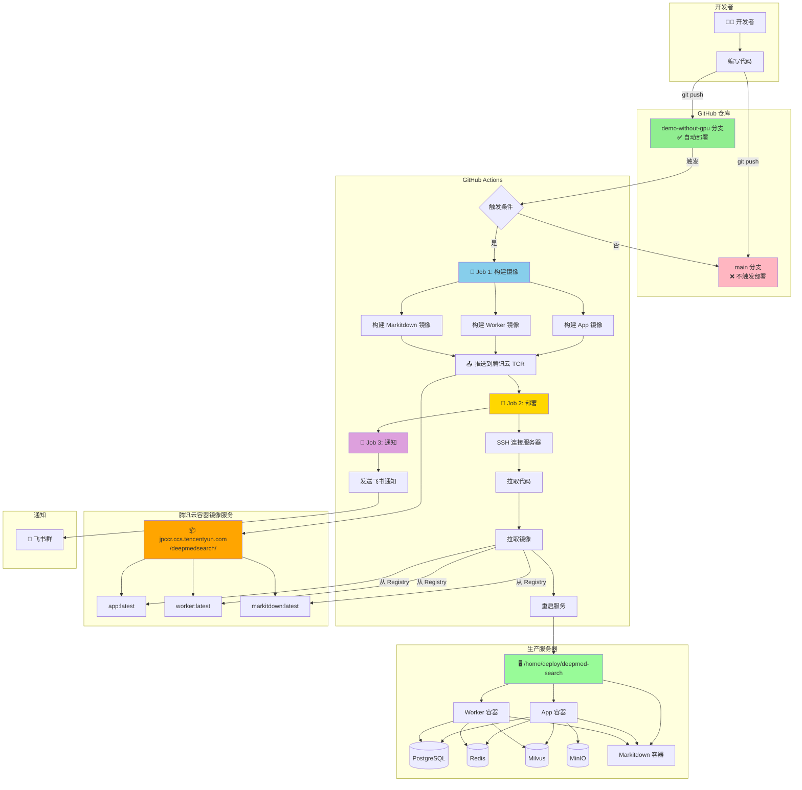
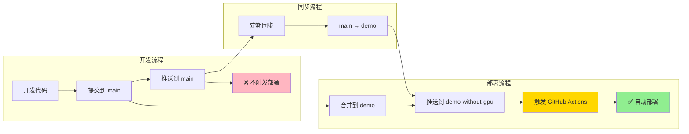
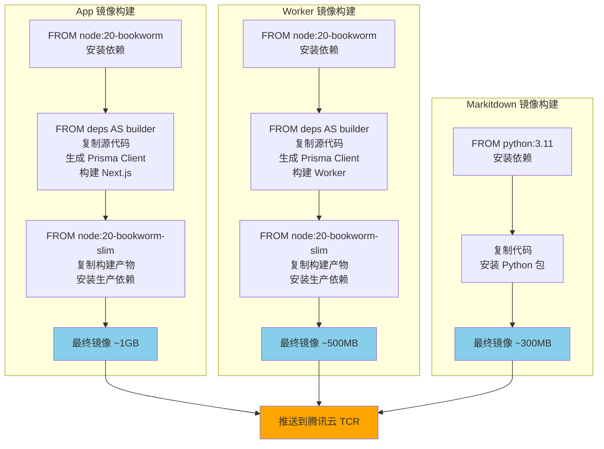
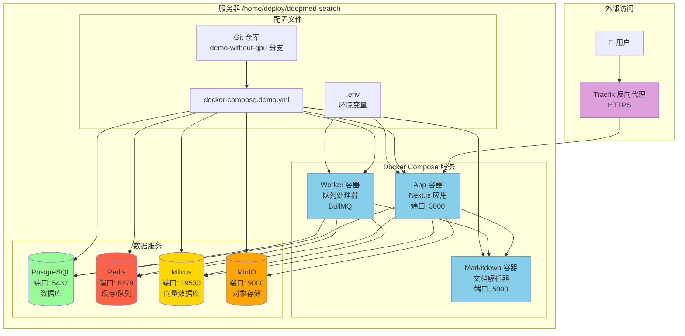
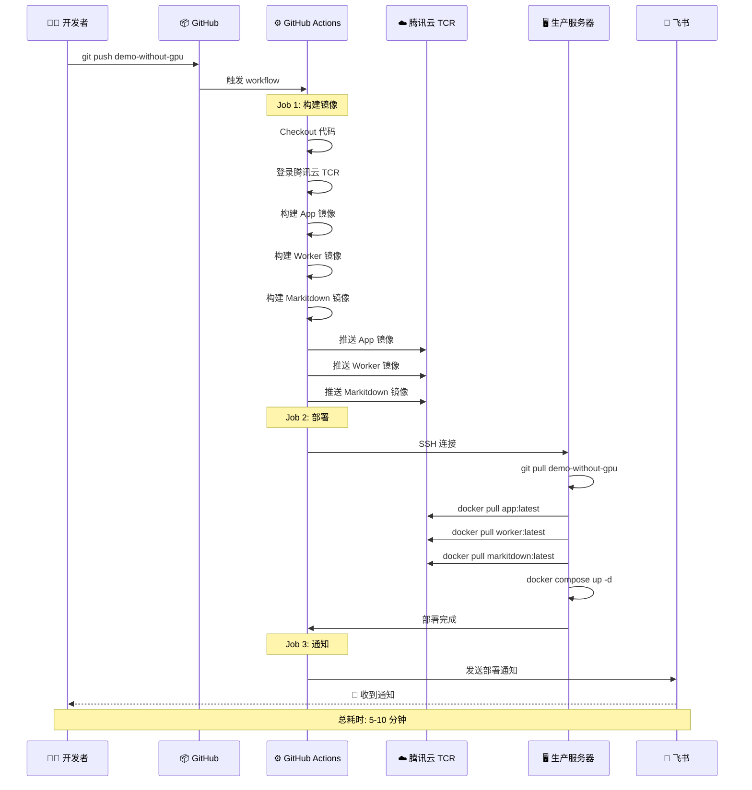
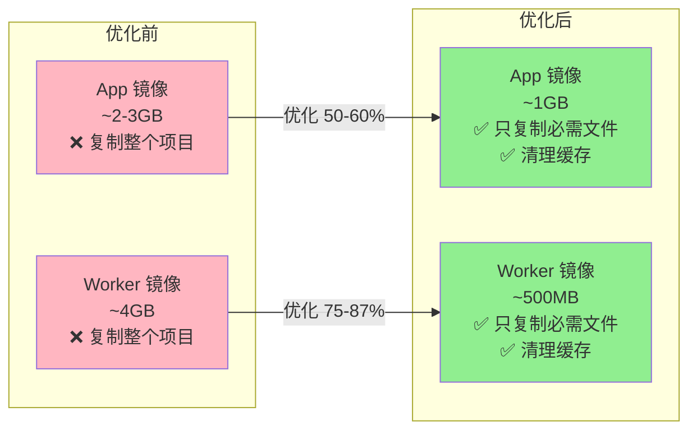
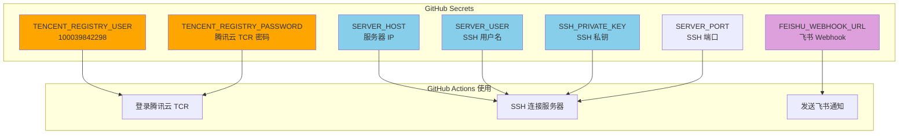
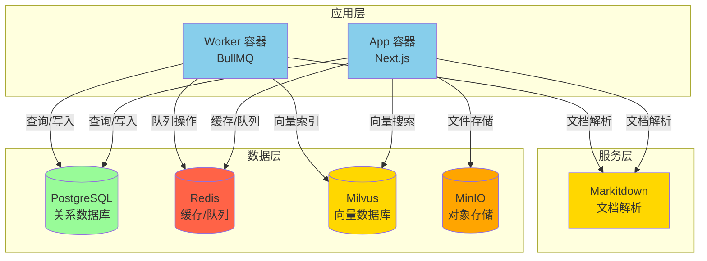

# 🎯 DeepMed Search CI/CD 流程图

## 📊 1. 完整 CI/CD 流程

## 🌿 2. 分支策略流程图

## 🐳 3. Docker 镜像构建流程

## 🏗️ 4. 服务器部署架构

## 🔄 5. 部署时序图

## 📦 6. 镜像优化对比

## 🔐 7. Secrets 配置关系

## 🎯 8. 服务依赖关系

---

## 📝 使用说明

这些 Mermaid 图表可以在以下地方查看：

1. **GitHub**: 直接在 Markdown 文件中渲染
2. **VS Code**: 安装 "Markdown Preview Mermaid Support" 插件
3. **在线编辑器**: https://mermaid.live/
4. **文档工具**: GitBook, Notion, Confluence 等

## 🔗 相关文档

- [CI/CD 详细配置](CICD_SETUP.md)
- [分支策略说明](../../BRANCHING_STRATEGY.md)
- [部署快速开始](../../DEPLOYMENT_QUICKSTART.md)
- [腾讯云配置](TENCENT_CLOUD_REGISTRY.md)

